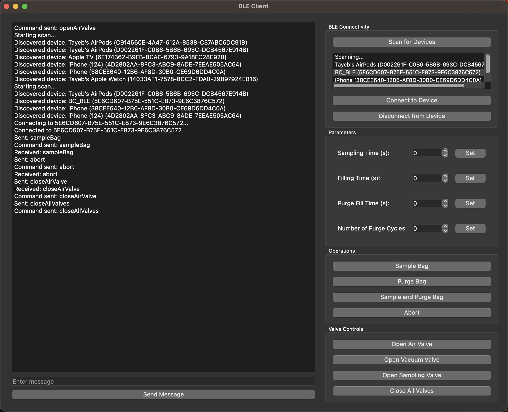
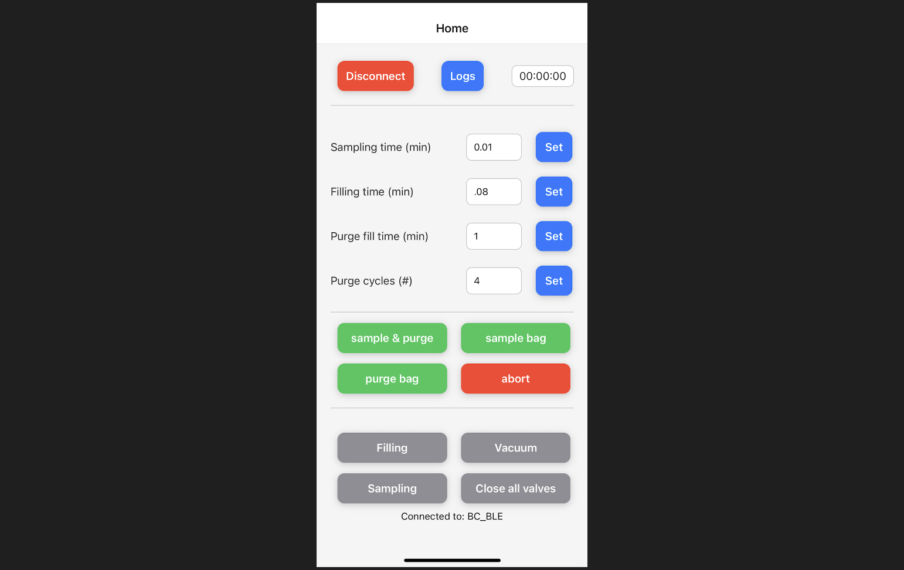

# Aerosol Sampling Chamber: Arduino, Python3, React Native, Bluetooth Low Energy

This project controls three valves in an aerosol sampling system:

1. **Filling Air Valve**: Controls the air filling.
2. **Vacuum Valve**: Used for purging the bag.
3. **Sampling Valve**: Draws air through a sampling device of choice.

Additionally, there is a contact sensor built in-house that detects when the bag is emptied.

## Installation

### 1. Microcontroller

The microcontroller is programmed using the Arduino programming language. Follow these steps to set it up:

1. **Install the Arduino IDE**: Download and install the Arduino IDE from [arduino.cc](https://www.arduino.cc/en/software).
2. **Open the Arduino File**: Open the provided Arduino file using the Arduino IDE.
3. **Upload the Code**: Connect your ESP32 device to your computer and upload the code.
4. **Monitor Serial Output**: Open the serial monitor in the Arduino IDE and set the baud rate to 115200 to see serial prints for operational clarity and troubleshooting.

### 2. Python Graphical User Interface

To interact with the BLE device for development purposes, a simple Python graphical user interface is included. The interface uses the `pyqt` library for graphical components and `bleak` for Bluetooth Low Energy connectivity. Follow these steps to set it up:

1. **Install the Libraries**:
   ```sh
   pip install bleak pyqt5
   ```
2. **Run the Interface**:
   ```sh
   cd pyqt
   python test.py
   ```

Below is a screenshot of the PyQt app:



### 3. Mobile Interface

The mobile interface is built using React Native. Since Bluetooth Low Energy is used in this project, the EXPO framework cannot be used unless ejected after initiation. The project uses bare React Native following the instructions on [reactnative.dev](https://reactnative.dev/docs/getting-started-without-a-framework). Before compiling, install the following React Native libraries (some may not be used in the current version):

```sh
npm install --save react-native-permissions
npm install @react-navigation/native @react-navigation/stack
npm install react-native-screens react-native-safe-area-context
npm install redux react-redux @reduxjs/toolkit
npm install --save react-native-ble-manager
npm install --save react-native-ble-plx
npm install react-native-gesture-handler
npm install react-native-reanimated
npm install @react-native-async-storage/async-storage
npm install react-native-vector-icons
npm install axios
```

Below is a screenshot of the main page of the app:



### 4. Wiring

The wiring diagram is shown below. Since the valves require 12 volts and the output of ESP32 is only 3V, MOSFET switches are used with a 12V DC power source. To get a stable and reproducible air flow, a 110V oilless pump is used which turns on upon sampling request using the same signal sent to open its valve. For the pump, a relay switch is used since MOSFET switches cannot handle this level of AC voltage. The valve is redundant but kept for future design changes. There is also a touch sensor that triggers when the opposite sides of the bag come together, indicating the bag is empty to stop sampling. This mechanism is also used for purging the bag programmatically since purging requires multiple emptying and refilling cycles.

Below is the diagram of the wiring:


